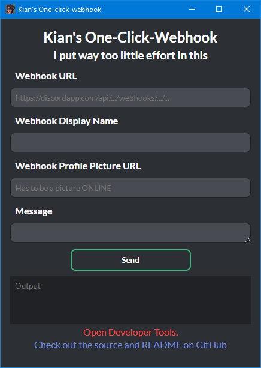

# discord-electron-ocw
## My first ElectronJS app. Pushes messages to discord webhooks.

More of a proof of concept than anything useful. Although I assume this will have some meming value since you can impersonate anyone.

## How to use
- Paste in the webhook URL (presumably from the discord app) (required)
- Webhook Display Name field overrides the default webhook name. Is not permanent. (optional)
- Webhook Profile Picture URL field overrides the default webhook profile picture. Is not permanent. (optional)
- Message is obviously the message you want to send. API capped at 2000 characters. (required)

## Features (yes im padding this readme out)
- Saves all fields except message to `Cache/formData`, which is JSON if you want to read it
- Relatively good-looking design (relatively doesn't really mean anything since this is my first web design proj)

---

## Screenshot

